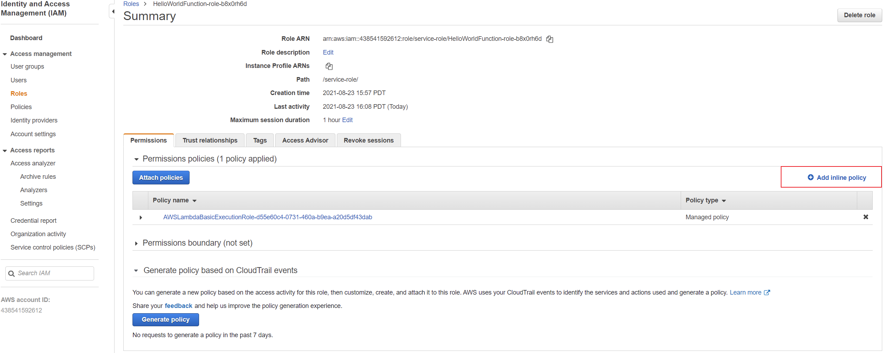
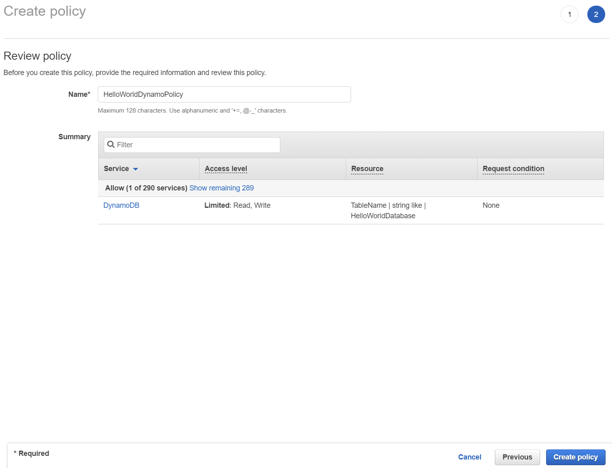

# AWS Lambda for Azure Functions user's tutorial (GUI edition)

To get the most from this tutorial, you must know how to deploy applications using Azure Funcitons. 

This is a free lab that takes 30 minutes to complete. Make sure you terminate all the services at the end of this lab. 

## Overview

In this tutorial, you will create a simple web application. You will first build a static web app that renders "Hello World." Then you will learn how to add functionality to the web app so the text that displays is based on a custom input you provide.
This tutorial will walk you through the steps to create this sample web application. You will learn to:
- Create a web app
- Connect the web app to a serverless back-end
- Add interactivity to your web app with an API and a database

## Application Architecture


- **AWS IAM -** We will use the [AWS Identity and Access Management (IAM) service](https://docs.aws.amazon.com/IAM/latest/UserGuide/introduction.html) to securely give our services the required permissions to interact with each other.
- **AWS Amplify -** All of your static web content, including HTML, CSS, JavaScript, images and other files, will be hosted by [AWS Amplify.](https://docs.aws.amazon.com/amplify/latest/userguide/welcome.html)
- **Amazon API Gateway -** We will use [Amazon API Gateway](https://docs.aws.amazon.com/apigateway/latest/developerguide/welcome.html) to create a RESTful API that will allow us to make calls to our Lambda function from a web client.
- **AWS Lambda -** You will use the compute service [AWS Lambda](https://docs.aws.amazon.com/lambda/latest/dg/welcome.html), to create serverless functions, writing a small piece of code in Python to add interactivity to your web page.
- **Amazon DynamoDB -** We will create a table to persist data using fully managed NoSQL database service, [Amazon DynamoDB.](https://docs.aws.amazon.com/amazondynamodb/latest/developerguide/Introduction.html) 

## Step 0: Before You Start

You will need to make sure you have the following components installed and set up before you start:

- **AWS Account –** Sign up for a free AWS account [here.](https://aws.amazon.com/premiumsupport/knowledge-center/create-and-activate-aws-account/)
- **Required IAM permissions** – With the personal AWS Free Account, you have the administrator permissions required to create and edit IAM policies. In any other kind of AWS account, the IAM security principal that you're using must have permissions to work with AWS Lambda IAM roles and service linked roles. You must complete all steps in this guide as the same user.
  
## Step 1: Create Web App
You will use the AWS Amplify Console to deploy the static resources for your web application.

1.1. Open your favorite text editor on your computer. Create a new file and **paste** the following HTML in it:

```
<!DOCTYPE html>
<html>
<head>
    <meta charset="UTF-8">
    <title>Hello World</title>
</head>

<body>
    Hello World
</body>
</html>
```

1.2. **Save** the file as *index.html*.

1.3. **ZIP (compress)** only the HTML file.

1.4. In a new browser window, log into the [Amplify Console](https://us-west-2.console.aws.amazon.com/amplify/home). NOTE: We will be using the **Oregon (us-west-2) region** for this tutorial.

1.5. Click the orange **Get Started** button.


1.6. In the **App Name** field type *GettingStarted*.


1.7. Under **Frontend environments** tab select **Deploy without Git provider**. This is what you should see on the screen:


1.8. Click the orange **Connect branch** button.

1.9. For **Environment** name type *dev*. Select the **Drag and drop** method. This is what you should see on your screen:


1.10. Click the **Choose files** button. Select the ZIP file you created in Step 1.3. Click the orange **Save and deploy** button. After a few seconds, you should see the message *Deployment successfully completed*.

## Step 2: Test your Web App

2.1. Click on the link under **Domain**.


2.2. Your web app will load in a new browser tab and render "Hello World." Congratulations!

We now have live web app users can interact with. Next we will create a Lambda function.

## Step 3: Create and Configure your Lambda Function

3.1. In a new browser tab, log into the [AWS Lambda Console.](https://console.aws.amazon.com/lambda/)

3.2. Make sure you **note that the region you are creating your function in is set to Oregon (us-west-2)**. You can see this at the very top of the page, next to your account name.

3.3. Click on the orange **Create Function** button.

3.4. Under **Function Name** type in *HelloWorldFunction*.

3.5. Select **Python 3.8** from the **runtime** drop-down.


3.6. Click on the orange **Create Function** button. You should see a green box at the top of your screen with the following message *Successfully created the function.*

3.7. Replace the code under the Function **Code** tab with the following:

```python
# import the JSON utility package since we will be working with a JSON object
import json
# define the handler function that the Lambda service will use an entry point
def lambda_handler(event, context):
# extract values from the event object we got from the Lambda service
    name = event['firstName'] +' '+ event['lastName']
# return a properly formatted JSON object
    return {
    'statusCode': 200,
    'body': json.dumps('Hello from Lambda, ' + name)
    }
```


3.8. Click the **Deploy** button.

3.9. Let's test our new function. Click on the **Test drop down** button. From that drop-down menu click on **Configure test event**.

3.10. Under **Event Name** type *HelloWorldTestEvent*.

3.11. Copy and paste the following JSON object to replace the default one:

```
{
"firstName": "Ada",
"lastName": "Lovelace"
}
```

3.12. Click the orange **Create** button a the bottom of the page.


3.13. Click the grey **Test** tab at the top to view the saved test event. Click on the orange **Test** button on the right to run the test and view results. You should see a light green box at the top of the page with the following text: "Execution result: succeeded." You can click on "details" to see the event the function returned.


Well done! You now have a working Lambda function.

## Step 4: Link the Lambda Function to the Web App

We will use Amazon API Gateway to create a RESTful API that will allow us to make calls to our Lambda function from a web client (typically refers to a user's web browser). API Gateway will act as a middle layer between the HTML client we created in Step 1 and the serverless back-end we created in Step 3.

### 4.1. Create a new REST API

4.1.1. Log into the [API Gateway Console](https://console.aws.amazon.com/apigateway/main/). Make sure you **note that the region you are creating this service is set to Oregon (us-west-2)**. You can see this at the very top of the page, next to your account name.

4.1.2. Find the **REST API** box and click the orange **Build** button in it.

4.1.3. Under **Choose the protocol**, select *REST*.

4.1.4. Under **Create new API**, select *New API*.

4.1.5. In the **API name** field type in *HelloWorldAPI*.

4.1.6. Select *Edge optimized* in the **Endpoint Type** drop-down (Note: Edge optimized endpoints is best for geographically distributed clients. This makes it a good choice for public services being accessed from the Internet. Regional endpoints are typically used for APIs that are accessed primarily from within the same AWS Region.)

4.1.7. Click the blue **Create API** button. Your settings should look like the following screenshot:


### 4.2. Create a new Resource and Method

4.2.1. In the left nav, click on **Resources** under your HelloWorld API.

4.2.2. With the **/** resource selected, click **Create Method** from the Action drop-down menu.

4.2.3. Select **POST** from the new drop-down that appears, then click on the checkmark.

4.2.4. Select **Lambda Function** for the integration type.

4.2.5. Select *us-west-2* from the **Lambda Region** drop down.

4.2.6. Type in *HelloWorldFunction* into the **Function** field.

4.2.7. Click the blue **Save** button.

4.2.8. You should see a message letting you know you are giving the API you are creating permission to call your Lambda function. Click the **OK** button.

4.2.9. With the newly created POST method selected, select **Enable CORS** from the Action drop-down menu. (Note: The CORS (Cross Origin Resource Sharing) mechanism uses HTTP headers to tell a browser to allow a given web application run at one origin (domain) and have permission to access selected resources from a server at a different origin.)

4.2.10. Leave the POST checkbox selected and click the blue **Enable CORS and replace existing CORS headers** button.


4.2.11. You should see a message asking you to confirm method changes. Click the blue **Yes, replace existing values** button.

### 4.3. Deploy API

4.3.1. In the **Actions** drop-down list select **Deploy API**.


4.3.2. Select **[New Stage]** in the **Deployment stage** drop-down list.

4.3.3. Enter *dev* for the **Stage Name**.

4.3.4. Choose **Deploy**.


4.3.5. **Copy and save** the URL next to **Invoke URL** (you will need it in Step 6).

### 4.4. Validate API

4.4.1. On the the left nav, click on **Resources**.

4.4.2. The methods for our API will now be listed on the right. Click on **POST**.

4.4.3. Click on the **small blue lightning bolt**.

4.4.4. Paste the following into the **Request Body** field:

```
{
    "firstName":"Grace",
    "lastName":"Hopper"
}
```

4.4.5. Click the blue **Test** button.

4.4.6. On the right side, you should see a response with **Code 200**.

Great! We have built and tested an API that calls our Lambda function.

## Step 5: Create a Data Table

We will create a table to persist data using Amazon DynamoDB. DynamoDB is a key-value database service, so we do not need to create a schema for our data. It has consistent performance at any scale and there are no servers to manage when using it.

Additionally, we will use the AWS Identity and Access Management (IAM) service to securely give our services the required permissions to interact with each other. Specifically, we are going to allow the Lambda function we created in Step 3 to write to our newly created DynamoDB table using an IAM policy. In order to do this, we will use the AWS SDK (Python) from our Lambda function.

### 5.1. Create a DynamoDB Table

5.1.1. Log into the [Amazon DynamoDB Console.](https://console.aws.amazon.com/dynamodb/home)

5.1.2. Make sure you **note that the region you are creating your table in is set to Oregon (us-west-2)**. You can see this at the very top of the page, next to your account name.

5.1.3. Click the blue **Create table** button.

5.1.4. Next to **Table name** type in *HelloWorldDatabase*.

5.1.5. In the **Primary Key** field type in *ID*.

5.1.6. Click the blue **Create** button.

5.1.7. Copy the table's **Amazon Resource Name (ARN)** from the right hand panel (you will need it later on in this step).

### 5.2. Create and Add IAM Policy to Lambda Function

5.2.1. Now that we have a table, let's edit our Lambda function to be able to write data to it. In a new browser window, open the [AWS Lambda Console.](https://console.aws.amazon.com/lambda/home)

5.2.2. **Click** on the function we created in Step 3 (if you have been using our examples, it will be called "HelloWorldFunction").

5.2.3. We'll be adding permissions to our function so it can use the DynamoDB service, and we'll be using AWS Identity and Access Management (IAM) to do so.

5.2.4. Click on the **Configuration** tab and select the **Permissions** tab on the left nav.

5.2.5. In the **Execution role** box click on the role. A new browser tab will open.

5.2.6. Click on **Add inline policy** on the right of the **Permissions policies** box.



5.2.7. Click on the **JSON** tab.

5.2.8. Paste the following policy in the text area, **taking care to replace your table's ARN in the "Resource" field on line 15:**

```python
{
"Version": "2012-10-17",
"Statement": [
    {
        "Sid": "VisualEditor0",
        "Effect": "Allow",
        "Action": [
            "dynamodb:PutItem",
            "dynamodb:DeleteItem",
            "dynamodb:GetItem",
            "dynamodb:Scan",
            "dynamodb:Query",
            "dynamodb:UpdateItem"
        ],
        "Resource": "YOUR-TABLE-ARN"
    }
    ]
}
```

5.2.9.  This policy will allow our Lambda function to read, edit or delete items, but restrict it to only be able to do so in the table we created.

5.2.10. Click the blue **Review Policy** button.

5.2.11. Next to **name** type in *HelloWorldDynamoPolicy*.



5.2.12. Click the blue **Create Policy** button.

5.2.13. You can now close this browser tab and go back to the tab for your Lambda function.

### 5.3. Modify Lambda Function to Write to DynamoDB Table

5.3.1. Click the **Code** tab

5.3.2. **Replace** the code for your function with the following:

```python
# import the json utility package since we will be working with a JSON object
import json
# import the AWS SDK (for Python the package name is boto3)
import boto3
# import two packages to help us with dates and date formatting
from time import gmtime, strftime

# create a DynamoDB object using the AWS SDK
dynamodb = boto3.resource('dynamodb')
# use the DynamoDB object to select our table
table = dynamodb.Table('HelloWorldDatabase')
# store the current time in a human readable format in a variable
now = strftime("%a, %d %b %Y %H:%M:%S +0000", gmtime())

# define the handler function that the Lambda service will use as an entry point
def lambda_handler(event, context):
# extract values from the event object we got from the Lambda service and store in a variable
    name = event['firstName'] +' '+ event['lastName']
# write name and time to the DynamoDB table using the object we instantiated and save response in a variable
    response = table.put_item(
        Item={
            'ID': name,
            'LatestGreetingTime':now
            })
# return a properly formatted JSON object
    return {
        'statusCode': 200,
        'body': json.dumps('Hello from Lambda, ' + name)
    }
```

5.3.3. Click the **Deploy** button.

### 5.3. Test the Changes

5.3.1. Click the grey **Test** tab at the top to view the saved test event. Click on the orange **Test** button on the right to run the test and view results. You should see a light green box at the top of the page with the following text: "Execution result: succeeded." You can click on "details" to see the event the function returned.

5.3.2. In a new browser tab, open the [DynamoDB Console.](https://console.aws.amazon.com/dynamodb/home)

5.3.3. Click on **Tables** on the left hand navigation bar.

5.3.4. Click on **HelloWorldDatabase**, which we created earlier in this Step.

5.3.5. Click on the **Items** tab on top. Items matching your test event should appear here. If you have been using our examples, the item ID will be *Ada Lovelace*. Every time your Lambda function executes, your DynamoDB table will be updated. If the same name is used, only the time stamp will change.

## Step 6: Add Interactivity to Your Web App

We will update the static website we created in Step 1 to invoke the REST API we created in Step 4. This will add the ability to display text based on what you input.

### 6.1. Update Web App with Amplify Console

6.1.1. Open the **index.html** file you created in Step 1.

6.1.2. Replace the existing code with the following:

```
<!DOCTYPE html>
<html>
<head>
    <meta charset="UTF-8">
    <title>Hello World</title>
    <!-- Add some CSS to change client UI -->
    <style>
    body {
        background-color: #232F3E;
        }
    label, button {
        color: #FF9900;
        font-family: Arial, Helvetica, sans-serif;
        font-size: 20px;
        margin-left: 40px;
        }
     input {
        color: #232F3E;
        font-family: Arial, Helvetica, sans-serif;
        font-size: 20px;
        margin-left: 20px;
        }
    </style>
    <script>
        // define the callAPI function that takes a first name and last name as parameters
        var callAPI = (firstName,lastName)=>{
            // instantiate a headers object
            var myHeaders = new Headers();
            // add content type header to object
            myHeaders.append("Content-Type", "application/json");
            // using built in JSON utility package turn object to string and store in a variable
            var raw = JSON.stringify({"firstName":firstName,"lastName":lastName});
            // create a JSON object with parameters for API call and store in a variable
            var requestOptions = {
                method: 'POST',
                headers: myHeaders,
                body: raw,
                redirect: 'follow'
            };
            // make API call with parameters and use promises to get response
            fetch("YOUR-API-INVOKE-URL", requestOptions)
            .then(response => response.text())
            .then(result => alert(JSON.parse(result).body))
            .catch(error => console.log('error', error));
        }
    </script>
</head>
<body>
    <form>
        <label>First Name :</label>
        <input type="text" id="fName">
        <label>Last Name :</label>
        <input type="text" id="lName">
        <!-- set button onClick method to call function we defined passing input values as parameters -->
        <button type="button" onclick="callAPI(document.getElementById('fName').value,document.getElementById('lName').value)">Call API</button>
    </form>
</body>
</html>
```

6.1.3. Make sure you add **YOUR-API-INVOKE-URL** in the code above (from Step 4). NOTE: If you do not have your API's URL, you can get it from the API Gateway Console by clicking on your API and then on "stages."

6.1.4. Save the file.

6.1.5. **ZIP (compress)** only the HTML file.

6.1.6. Open the [Amplify Console.](https://us-west-2.console.aws.amazon.com/amplify/home)

6.1.7. Click on the web app created in Step 1.

6.1.8. Click the white **Choose files** button.

6.1.9. Select the **ZIP file** you created in Step 6.1.5.

6.1.10. When the file is uploaded, a Deployment process will automatically begin. Once you see a green bar, your deployment will be complete.

### 6.2. Test Updated Web App

6.2.1. Click on the URL under **Domain**.

6.2.2. Your updated web app should load in your browser.

6.2.3. Fill in your name (or whatever you prefer) and click the "Call API" button.

6.2.4. You should see a message that starts with "Hello from Lambda" followed by the text you filled in.

#### Congratulations, you now have a working web app deployed by Amplify Console that can call a Lambda function via API Gateway!

#### All the AWS services we set up can securely communicate with each other. When a user clicks on a button in the web app, it makes a call to our API, which triggers our Lambda function. Our Lambda function writes to a database and returns a message to our client via API Gateway. All permissions are managed by IAM.

## Step 7: Delete Services

##### All the services utilized leverage the Free tier of the AWS Account. This will incur no additional cost to your subscription.

To delete the services, go to the individually listed services in the **Application Architecture** section of this lab on your AWS Management Console and delete them.
